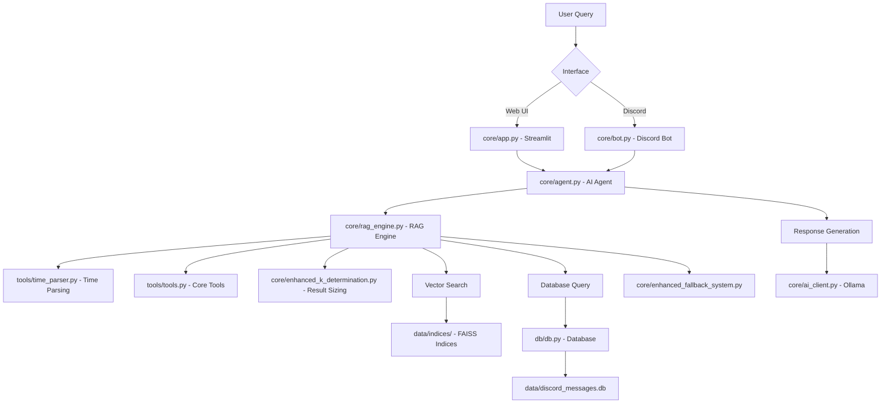
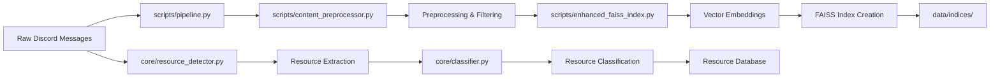
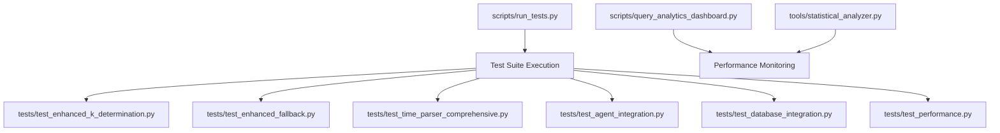

# 🔗 **System Architecture & Dependencies Map**

## 📊 **Core System Flow**

## 🏗️ **Data Processing Pipeline**

## 🧪 **Testing & Quality Assurance**

## 🔄 **File Relationship Matrix**

### **CORE DEPENDENCIES**
| File | Depends On | Used By |
|------|------------|---------|
| `core/app.py` | agent.py, tools.py, query_logs.py | *Main Streamlit UI* |
| `core/bot.py` | agent.py, config.py, query_logs.py | *Discord Interface* |
| `core/agent.py` | rag_engine.py, enhanced_fallback_system.py | app.py, bot.py |
| `core/rag_engine.py` | ai_client.py, tools.py, time_parser.py | agent.py |
| `core/ai_client.py` | config.py | rag_engine.py, enhanced_fallback_system.py |

### **PIPELINE DEPENDENCIES**
| File | Depends On | Purpose |
|------|------------|---------|
| `scripts/pipeline.py` | content_preprocessor.py, enhanced_faiss_index.py | Main orchestration |
| `scripts/enhanced_pipeline_with_resources.py` | pipeline.py + resource_detector.py | Enhanced with resources |
| `scripts/build_community_faiss_index.py` | content_preprocessor.py | Community messages index |
| `scripts/build_enhanced_faiss_index.py` | enhanced_faiss_index.py | Advanced features index |
| `scripts/build_resource_faiss_index.py` | resource_detector.py | Resource search index |

### **UTILITY DEPENDENCIES**
| File | Depends On | Purpose |
|------|------------|---------|
| `tools/tools.py` | db.py, models.py | Core message utilities |
| `tools/time_parser.py` | *standalone* | Natural language time parsing |
| `core/resource_detector.py` | classifier.py | URL/content analysis |
| `core/enhanced_k_determination.py` | db.py | Intelligent result sizing |

## 🎯 **Component Classification**

### **🟢 TIER 1: ESSENTIAL CORE (Never Remove)**
**System cannot function without these:**
- `core/app.py` - Main UI
- `core/bot.py` - Discord interface  
- `core/agent.py` - AI orchestration
- `core/rag_engine.py` - Search engine
- `core/ai_client.py` - LLM interface
- `db/*.py` - Database layer
- `tools/tools.py` - Core utilities
- `tools/time_parser.py` - Time parsing

### **🟡 TIER 2: PRODUCTION FEATURES (Important)**
**Major features that enhance functionality:**
- `core/enhanced_fallback_system.py` - Error handling
- `core/enhanced_k_determination.py` - Result optimization
- `core/resource_detector.py` - Resource analysis
- `scripts/pipeline.py` - Data processing
- `scripts/content_preprocessor.py` - Message preprocessing
- Index builders (3 files) - Search indices

### **🔵 TIER 3: QUALITY & MONITORING (Useful)**
**Testing, analytics, and quality assurance:**
- Main test files (6 files)
- `scripts/run_tests.py` - Test automation
- `scripts/query_analytics_dashboard.py` - Analytics
- `tools/statistical_analyzer.py` - Metrics

### **🟠 TIER 4: DEVELOPMENT TOOLS (Optional)**
**Development aid but not production critical:**
- Analysis scripts (7 files)
- Evaluation tools (2 files)
- Enhanced community preprocessor

### **🔴 TIER 5: LEGACY/ARCHIVE (Remove/Archive)**
**Old versions or one-time use scripts:**
- `core/embed_store.py` - Replaced by enhanced system
- `core/preprocessing.py` - Superseded by content_preprocessor.py
- Migration scripts (3 files) - One-time use complete
- Backup files (2 files) - Archive purposes only

## 📋 **Cleanup Priority Recommendations**

### **IMMEDIATE (High Impact, Low Risk)**
1. **Archive Legacy Core Files** → `archive/legacy/`
   - `core/embed_store.py`, `core/preprocessing.py`, `core/batch_detect.py`, `core/fetch_messages.py`
   
2. **Archive Migration Scripts** → `archive/migrations/`
   - `migrate_add_preprocessing_fields.py`, `populate_preprocessing_data.py`, `fix_embedding_model.py`

### **NEXT PHASE (Medium Impact)**
3. **Organize Analysis Tools** → `scripts/analysis/`
   - All `analyze_*.py` scripts, `evaluate_embedding_models.py`
   
4. **Organize Utilities** → `scripts/utils/`
   - `cleanup_root.py`, `tools/clean_resources_db.py`, etc.

### **FINAL PHASE (Low Impact)**
5. **Archive Backup Files** → `archive/backup/`
   - `core/repo_sync*.py` files

**Result:** Clean, focused codebase with **~25 core files** instead of **60+ mixed files**
