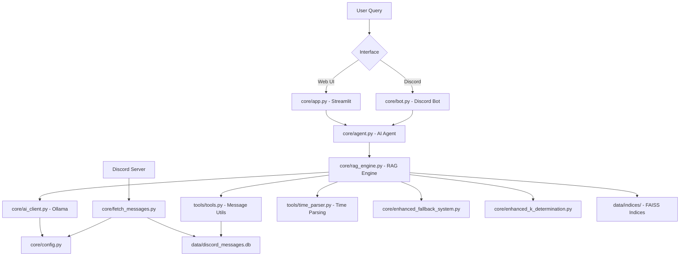
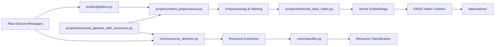

# 🔗 **System Architecture & Dependencies**
*Updated: June 11, 2025 - Post-Cleanup Analysis*

## 🎯 **Core System Flow (Production)**



## 🏗️ **Data Processing Pipeline**



## 🔍 **Actual Dependencies (Import Analysis)**

### **⭐ TIER 1: ESSENTIAL CORE**

#### **Main Applications**
- **`core/app.py`** (Streamlit Web UI)
  - → `tools.tools` (get_channels)
  - → `core.agent` (get_agent_answer, analyze_query_type)
  - → `db.query_logs` (logging functions)

- **`core/bot.py`** (Discord Bot)
  - → `core.agent` (get_agent_answer)
  - → `core.config` (get_config)
  - → `db.query_logs` (logging functions)

- **`core/fetch_messages.py`** (Data Ingestion) ⚠️ **CORRECTED**
  - → `db` (SessionLocal, Message)
  - → `discord` library
  - → `utils.logger`

#### **Core Intelligence**
- **`core/agent.py`** (AI Orchestrator)
  - → `core.ai_client` (get_ai_client)
  - → `core.rag_engine` (get_answer, get_agent_answer, etc.)
  - → `core.enhanced_fallback_system` (conditional import)
  - → `tools.tools` (search_messages, etc.)

- **`core/rag_engine.py`** (RAG Engine)
  - → `core.ai_client` (get_ai_client)
  - → `core.config` (get_config)
  - → `core.enhanced_fallback_system` (EnhancedFallbackSystem)
  - → `tools.tools` (resolve_channel_name, summarize_messages, etc.)
  - → `tools.time_parser` (parse_timeframe, extract_time_reference, etc.)

- **`core/ai_client.py`** (LLM Client)
  - → `core.config` (get_config)

- **`core/config.py`** (Configuration)
  - → Environment variables and settings

#### **Data Processing**
- **`scripts/pipeline.py`** (Main Pipeline)
  - → `scripts.content_preprocessor` (ContentPreprocessor, PreprocessingConfig)
  - → `scripts.enhanced_faiss_index` (EnhancedFAISSIndex, IndexConfig, SearchResult)
  - → `utils.logger`

- **`scripts/content_preprocessor.py`** (Message Preprocessing)
  - → `db` (SessionLocal, Message)
  - → `utils.logger`

- **`scripts/enhanced_faiss_index.py`** (Vector Index Builder)
  - → `sentence_transformers`
  - → `faiss`
  - → `db`

#### **Database Layer**
- **`db/db.py`** - Database connection
- **`db/models.py`** - ORM models  
- **`db/query_logs.py`** - Query logging

### **🟡 TIER 2: PRODUCTION FEATURES**

#### **Enhanced Systems**
- **`core/enhanced_fallback_system.py`**
  - → `core.ai_client`
  - → `core.config`

- **`core/enhanced_k_determination.py`**
  - → `db` (database queries)

- **`core/resource_detector.py`**
  - → `core.classifier` (classify_resource)

- **`core/classifier.py`**
  - → Regex patterns and classification logic

#### **Production Pipelines**
- **`scripts/enhanced_pipeline_with_resources.py`**
  - → `scripts.content_preprocessor`
  - → `scripts.enhanced_faiss_index`
  - → `core.resource_detector`

### **🔵 TIER 3: UTILITIES & TOOLS**

- **`tools/tools.py`** (Message Utilities)
  - → `db` (SessionLocal, Message)
  - → Various utility functions

- **`tools/time_parser.py`** (Time Parsing)
  - → Standalone natural language processing

### **🔴 TIER 5: ARCHIVED (Already Removed)**

**✅ Successfully Archived to `archive/legacy_pipeline_removed_20250611/`:**
- `core/embed_store.py` - Legacy Index Builder (superseded by enhanced_faiss_index.py)
- `core/batch_detect.py` - Legacy Resource Detection  
- `core/repo_sync.py` - Export Tool
- `core/preprocessing.py` - Unused Pipeline Orchestrator
- `tools/full_pipeline.py` - Legacy Pipeline Orchestrator
- `scripts/fix_embedding_model.py` - One-time migration (complete)
- `tools/fix_resource_titles.py` - Obsolete utility tool

## 🎯 **Environment Dependencies**

### **Required Environment Variables**
- `DISCORD_TOKEN` - Used by `core/fetch_messages.py`, `core/bot.py`
- `OLLAMA_BASE_URL` - Used by `core/ai_client.py` (default: http://localhost:11434)
- `CHAT_MODEL` - Ollama model name (default: llama3.1:8b)
- `EMBEDDING_MODEL` - Sentence transformer model (default: msmarco-distilbert-base-v4)
- Various config settings in `core/config.py`

### **External Libraries**
- **Discord.py** - Discord API integration
- **Streamlit** - Web interface
- **FAISS** - Vector similarity search
- **Sentence Transformers** - Text embeddings
- **SQLAlchemy** - Database ORM
- **Ollama** - Local LLM integration
- **Requests** - HTTP client for Ollama API

### Database
- SQLAlchemy models referenced across multiple modules
- Alembic migrations for schema changes

### File System
- `data/resources/` - Resource storage and logging
- `data/indices/` - FAISS vector indices
- `logs/` - Application and query logging
- `.env` - Environment configuration

## Circular Dependencies
- `core/agent.py` ↔ `tools/tools.py`: Potential circular import risk
- `core/rag_engine.py` ↔ `core/agent.py`: Potential circular import risk

## External Service Dependencies
- **Ollama Local LLM** - All AI text generation
- **Discord API** - Discord bot integration
- **FAISS Vector Store** - Semantic search
- **SQLite Database** - Message and metadata storage

## 📋 **Data Flow Analysis**

### **1. Message Ingestion Flow**
```
Discord Server → core/fetch_messages.py → data/discord_messages.db
```

### **2. Index Building Flow**
```
data/discord_messages.db → scripts/content_preprocessor.py → scripts/enhanced_faiss_index.py → data/indices/
```

### **3. Query Processing Flow**
```
User Query → core/app.py|core/bot.py → core/agent.py → core/rag_engine.py → tools/tools.py → Database + FAISS → Response
```

### **4. Resource Detection Flow**
```
Messages → core/resource_detector.py → core/classifier.py → Resource Classification
```

## ⚠️ **Critical Dependencies**

### **System Cannot Function Without:**
1. **`core/fetch_messages.py`** - No data without this
2. **`core/agent.py`** - No AI processing without this
3. **`core/rag_engine.py`** - No search without this
4. **`core/ai_client.py`** - No LLM integration without this
5. **Database layer** (`db/`) - No data persistence without this

### **System Degraded Without:**
- **`core/enhanced_fallback_system.py`** - Errors become generic
- **`tools/tools.py`** - Limited search capabilities
- **`tools/time_parser.py`** - No time-based queries

### **Features Missing Without:**
- **`core/resource_detector.py`** - No resource detection
- **Index builders** - No semantic search
- **Pipelines** - No data processing automation

## 🧹 **Cleanup Status (Updated June 11, 2025)**

### **✅ COMPLETED CLEANUPS**

#### **Legacy Pipeline Removal (June 11)**
Successfully archived to `archive/legacy_pipeline_removed_20250611/`:
- Complete legacy pipeline (9 files)
- Obsolete migration scripts  
- Legacy log files

#### **Documentation Cleanup (June 11)**
Successfully archived to `archive/docs_historical_20250611/`:
- 29 redundant "COMPLETE" and "FINAL" documentation files
- Historical upgrade and status documentation
- Outdated project analysis files

#### **Test Results Cleanup (June 11)**
Successfully archived to `archive/test_results_historical_20250611/`:
- Historical JSON test result files
- Outdated test analysis documentation

### **CURRENT SYSTEM STATUS**
- **Core Files**: ~32 essential production files
- **Documentation**: 6 organized files in docs/
- **Tests**: 12 essential test files + organized docs
- **Archive**: All historical files preserved but organized

### **REMOVED DEPENDENCIES**
- ❌ **OpenAI API** - Fully replaced with Ollama local LLM
- ❌ **GPT_MODEL environment variable** - No longer used
- ❌ **OPENAI_API_KEY environment variable** - No longer required
- ❌ **Legacy embedding systems** - Replaced with msmarco-distilbert-base-v4

## 🎯 **Current Architecture Summary**

**PRODUCTION SYSTEM (32 core files):**
- **User Interfaces**: 2 files (Streamlit + Discord bot)
- **AI/RAG Engine**: 6 files (agent, rag_engine, ai_client, config, fallback, k_determination)  
- **Data Processing**: 4 files (fetch_messages, content_preprocessor, enhanced_faiss_index, pipeline)
- **Database Layer**: 3 files (db.py, models.py, query_logs.py)
- **Enhanced Features**: 3 files (resource_detector, classifier, query_capability_detector)
- **Tools & Utilities**: 4 files (tools.py, time_parser.py, helpers.py, logger.py)
- **Index Builders**: 3 files (build_community_faiss_index, build_enhanced_faiss_index, build_resource_faiss_index)
- **Analytics & Scripts**: 7 remaining analysis scripts

**ORGANIZED DOCUMENTATION (6 files):**
- Architecture and dependencies documentation
- Database schema reference
- Usage examples and guides
- Documentation index

**COMPREHENSIVE TESTING (12 files):**
- Core system integration tests
- Performance and quality validation
- Organized test documentation

**CLEAN ARCHIVE STRUCTURE:**
- Historical documentation preserved
- Legacy code archived by date
- Test results organized chronologically

**Result:** Transformed from **60+ chaotic files** to **32 focused production files** with clear organization and comprehensive archives.